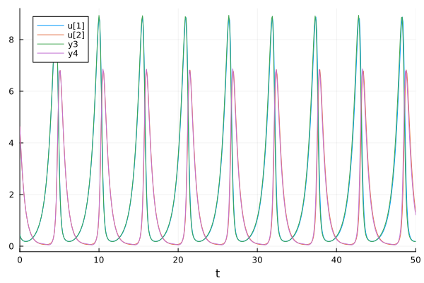

# LVModels

[](https://ge27zib.github.io/LVModels.jl/stable/)
[](https://ge27zib.github.io/LVModels.jl/dev/)
[](https://github.com/ge27zib/LVModels.jl/actions/workflows/CI.yml?query=branch%3Amaster)

LVModels.jl is a Julia package for Universal Differential Equation (UDE)-based symbolic regression of generalized Lotka-Volterra (LV) systems. This package builds upon the approach from the paper [Universal Differential Equations for Scientific Machine Learning](https://arxiv.org/abs/2001.04385) and successfully extends it to three-dimensional LV systems.

## Features

* Reproduction of Fig. 2 from the UDE paper: Implements and verifies the original experiment.
* Extension to 3D Lotka-Volterra systems: Adapts the method for learning governing equations of higher-dimensional dynamical systems.
* Training Neural ODEs: Leverages neural networks to model unknown terms in the differential equations.
* Symbolic Regression: Extracts interpretable expressions for the learned governing equations.

## Installation

```julia
using Pkg
Pkg.add(url="https://github.com/ge27zib/LVModels.jl.git")
```

## Usage

```julia
using LVModels

@load "lv_2d_scenario1.jld2" model # Load a pre-trained model or use the package to train a NODE 

plt_traj, plt_interaction, plt_l2_error, plt_re = plot_model_performance(sol, t, X_sparse, train_70, model, U_re, U_truth, mask, dt)
display(plt_traj)
```



For more details about package usage, refer to the [documentation](https://ge27zib.github.io/LVModels.jl/dev/) and examples in the scripts section.

## Dependencies 

The package use [NODEData.jl](https://github.com/maximilian-gelbrecht/NODEData.jl) for loading batches of data which is (so far) not in the general registry, please install it from the repository.
